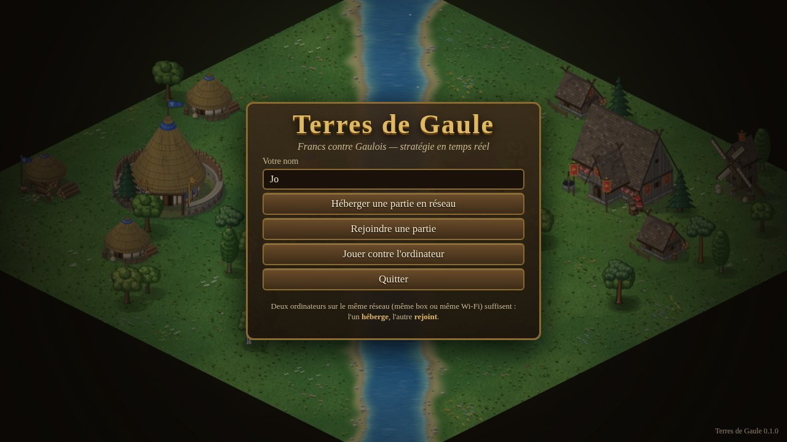
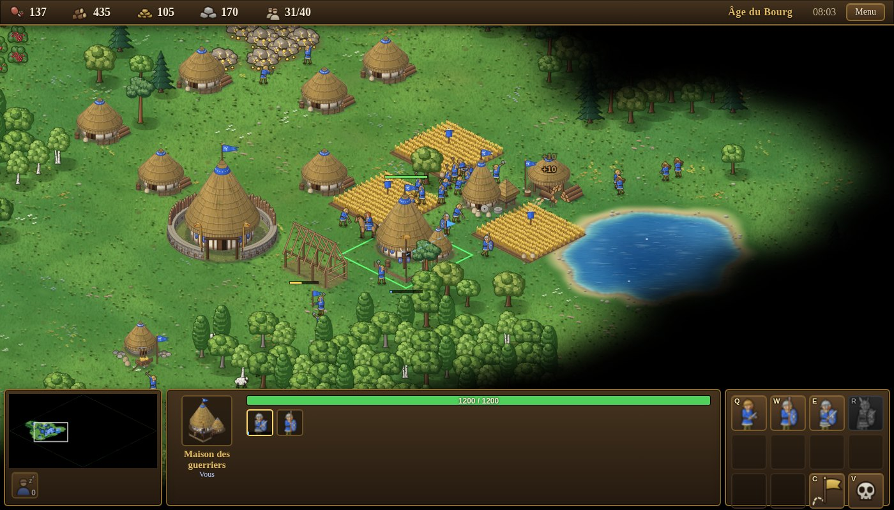
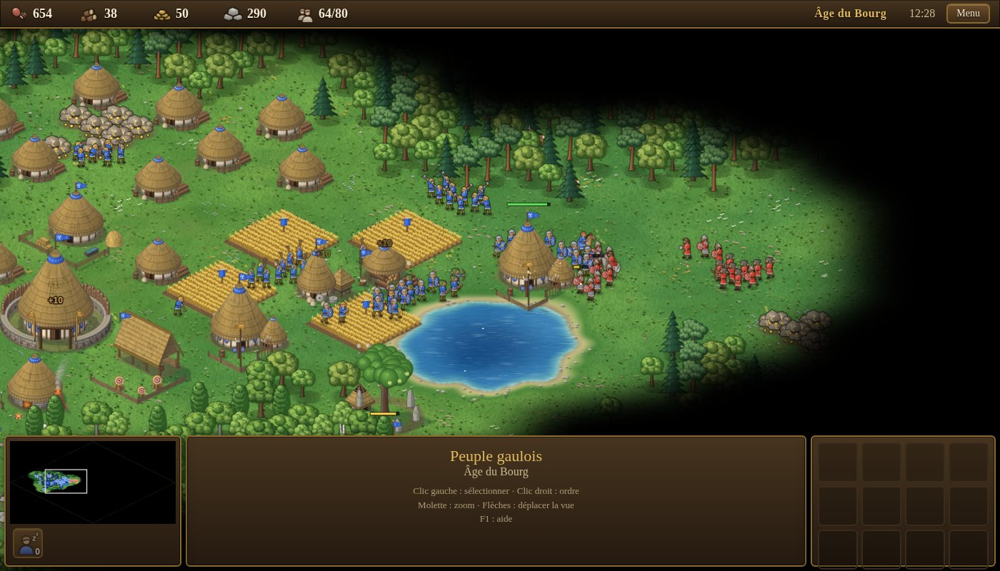
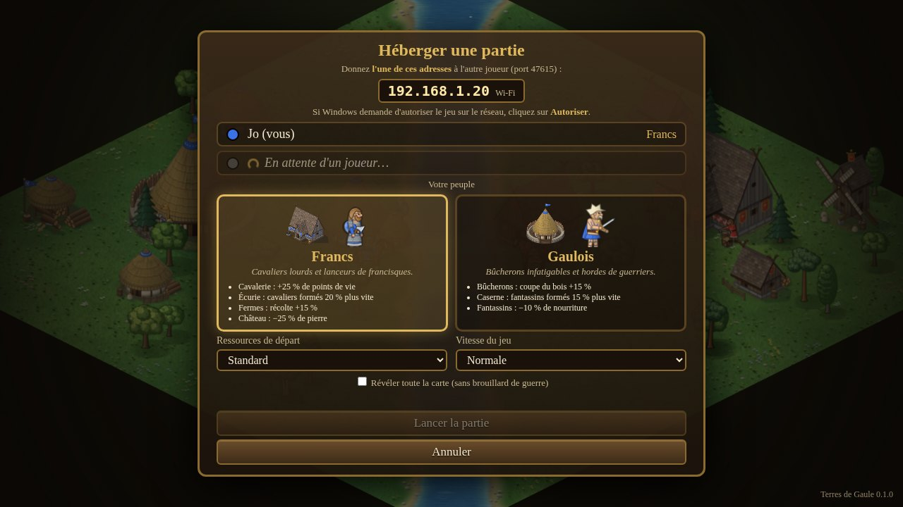

# Terres de Gaule

Jeu de stratégie en temps réel façon *Age of Empires*, **Francs contre Gaulois**, à jouer **à deux en réseau local**
(deux PC sur la même box ou le même Wi-Fi) ou seul contre l'ordinateur. Une seule carte : *La Rivière des Carnutes*.

- 2 peuples aux bonus et unités uniques différents (Francs : cavalerie lourde et francisque ; Gaulois : bûcherons, hordes de fantassins et gésates)
- 3 âges, 19 unités, 18 bâtiments, 37 technologies : villageois, récolte (bois, nourriture, or, pierre), fermes, chasse, pêche,
  construction, armées, béliers et catapultes, tours et château, brouillard de guerre
- Le **port** et les **bateaux** (barques de pêche, drakkars et navires vénètes qui se battent sur la rivière), le **marché**
  (achat et vente de ressources aux cours variables), le **Scriptorium / Cercle des druides** (recherches de médecine, de
  cartographie…), les **héros** Clovis et Vercingétorix (aura d'attaque) et la **merveille** (tenez-la 10 minutes pour gagner)
- Application de bureau Windows (un seul `.exe`), tout est dessiné par le code (aucune image externe)

## Aperçu



*Un village gaulois (huttes rondes, champs, forêts) et son interface : ici la maison des guerriers est sélectionnée.*



*Les Francs (en rouge) attaquent un village gaulois (en bleu).*



*Le salon de l'hôte : il donne son adresse à l'autre joueur, qui la voit apparaître dans sa liste ou la saisit.*



## Jouer

### 1. Récupérer le jeu

Le fichier `.exe` est fabriqué automatiquement sur GitHub à chaque mise à jour :

1. Ouvrez l'onglet **Actions** du dépôt ([liste des compilations](../../actions/workflows/build-windows.yml)), puis la dernière exécution **« Compiler pour Windows »** (coche verte).
2. En bas de la page, téléchargez l'archive **TerresDeGaule-Windows** (il faut être connecté à GitHub) et décompressez-la.
3. Vous obtenez deux fichiers :
   - **`TerresDeGaule-…-portable.exe`** : se lance d'un double-clic, sans installation (recommandé pour l'envoyer à quelqu'un ; le tout premier démarrage prend quelques secondes) ;
   - `TerresDeGaule-Setup-….exe` : installeur classique.

> **Windows affichera un avertissement bleu** (« Windows a protégé votre ordinateur ») car le jeu n'est pas signé numériquement.
> Cliquez sur **Informations complémentaires**, puis **Exécuter quand même**. Ce n'est demandé qu'une fois.

Pour qu'une personne qui n'a pas de compte GitHub reçoive le jeu, envoyez-lui simplement le fichier `…-portable.exe`
(clé USB, messagerie, Drive…). Si un antivirus le met en quarantaine, autorisez-le : il n'y a rien de dangereux dedans.

### 2. Jouer à deux en réseau local

Les deux ordinateurs doivent être **sur le même réseau** (même box, même Wi-Fi ; pas de VPN) et utiliser **exactement la même version du jeu**
(le numéro s'affiche en bas à droite du menu ; en cas de différence, le jeu refuse la connexion et l'indique : envoyez alors le même `.exe` aux deux joueurs).

**Joueur 1 (l'hôte)**
1. Menu principal → **Héberger une partie en réseau**.
2. Windows demande d'autoriser le jeu sur le réseau : cliquez sur **Autoriser** (réseaux privés). Sans cela, l'autre joueur ne pourra pas se connecter.
3. Le jeu affiche une ou plusieurs **adresses** (par exemple `192.168.1.20`) : donnez-la à l'autre joueur. Choisissez votre peuple et les options.

**Joueur 2 (l'invité)**
1. Menu principal → **Rejoindre une partie**.
2. La partie de l'hôte apparaît automatiquement dans la liste ; sinon saisissez l'adresse donnée par l'hôte, puis **Se connecter**.
3. Choisissez votre peuple et attendez que l'hôte lance la partie.

L'hôte clique sur **Lancer la partie** dès que l'invité est connecté. Le PC de l'hôte calcule la partie : il est préférable que ce soit
le plus puissant. Si l'invité se déconnecte, l'hôte gagne ; si l'hôte se déconnecte, la partie s'arrête.

**En cas de problème de connexion**
- « Connexion refusée » ou « délai dépassé » : le pare-feu de l'hôte bloque le jeu (Paramètres Windows → Pare-feu → *Autoriser une application* → « Terres de Gaule », cases *Privé* et *Public* cochées), ou l'adresse est fausse, ou les deux PC ne sont pas sur le même réseau.
- Le jeu utilise le port **47615** (TCP) pour la partie et **47616** (UDP) pour la recherche automatique des parties.
- Plusieurs adresses affichées : essayez celle qui commence par `192.168.` ou `10.` (les autres viennent souvent de VPN ou de machines virtuelles).

### 3. Jouer contre l'ordinateur

Menu principal → **Jouer contre l'ordinateur** : choisissez votre peuple, le niveau (facile, moyen, difficile), les ressources de départ et la vitesse.

## Commandes

| Action | Commande |
|---|---|
| Sélectionner | clic gauche, ou cadre en glissant ; double-clic = tous les mêmes à l'écran |
| Ordre (déplacer, attaquer, récolter, réparer…) | **clic droit** ; **Maj + clic droit** pour enchaîner les ordres |
| Construire | sélectionner un villageois → *Bâtiments civils / militaires* → choisir → clic sur la carte (Maj : en poser plusieurs) |
| Former une unité / rechercher | sélectionner le bâtiment → bouton (Maj + clic : en former 5) |
| Point de ralliement | bâtiment sélectionné → clic droit sur la carte ou sur une ressource |
| Attaque en marchant | soldats sélectionnés → bouton « Attaquer en marchant » |
| Commandes du panneau | touches **A Z E R / Q S D F / W X C V** selon votre clavier (elles suivent la disposition des boutons) |
| Groupes | `Ctrl + 1…9` créer, `1…9` rappeler (deux fois : centrer) |
| Villageois inoccupé | `.` ou `,` |
| Salle principale / dernière attaque | `H` / `Espace` |
| Vue | flèches, molette (zoom), clic molette ; en plein écran, bord de l'écran |
| Détruire la sélection | `Suppr` (à confirmer) |
| Pause / menu / aide / plein écran | `P` / `F10` ou `Échap` / `F1` / `F11` |

**But :** détruire tous les bâtiments et villageois de l'adversaire. Récoltez, construisez des maisons pour agrandir la population,
passez à l'âge suivant (Grande Salle ou Oppidum), formez une armée équilibrée : les lanciers battent la cavalerie, la cavalerie
bat les archers, les archers et les épéistes se complètent, les béliers abattent les bâtiments.

## Développer

```bash
npm install          # dépendances (Electron, electron-builder, esbuild)
npm test             # tests automatiques (réseau, chemins, simulation, synchronisation, session)
npm start            # compile et lance le jeu
npm run dist         # fabrique les .exe Windows (sous Windows)
```

Outils de contrôle (dans `tools/`) : `sim-match.mjs` (IA contre IA sans interface), `balance.mjs` (équilibre des peuples),
`map-image.mjs` (aperçu de la carte), `ui-test.mjs` et `e2e-lan.mjs` (tests avec de vrais clics ; le second lance deux instances d'Electron
et les fait jouer en réseau), `shot.mjs` (capture d'un script dessiné dans Chromium).

### Architecture

| Dossier | Rôle |
|---|---|
| `electron/` | processus principal : fenêtre, réseau TCP/UDP (`netcore.cjs`), pont sécurisé vers le jeu |
| `src/core/` | règles du jeu, sans dépendance à l'interface : données (`defs.js`), carte, chemins A\*, simulation, IA, instantanés réseau |
| `src/client/` | rendu isométrique, interface, menus, sons, état côté joueur |
| `src/client/art/` | dessin procédural des bâtiments, unités, terrain, icônes (contrat : `docs/ART.md`) |
| `test/` | tests automatiques (`node --test`) |

**Réseau.** L'hôte exécute la simulation (à 20 pas par seconde) et envoie à l'invité, après chaque pas, uniquement ce qui a changé et qu'il a le droit de voir
(brouillard de guerre). L'invité envoie ses commandes. Le solo est le même code avec une IA à la place du second joueur.
Toutes les règles et caractéristiques sont dans `src/core/defs.js` : pour équilibrer le jeu, on ne touche qu'à ce fichier.
